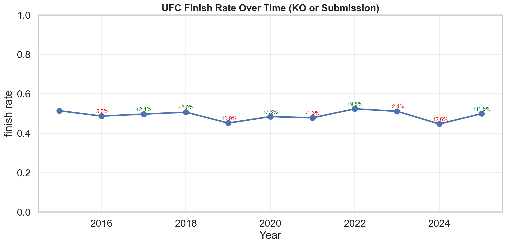
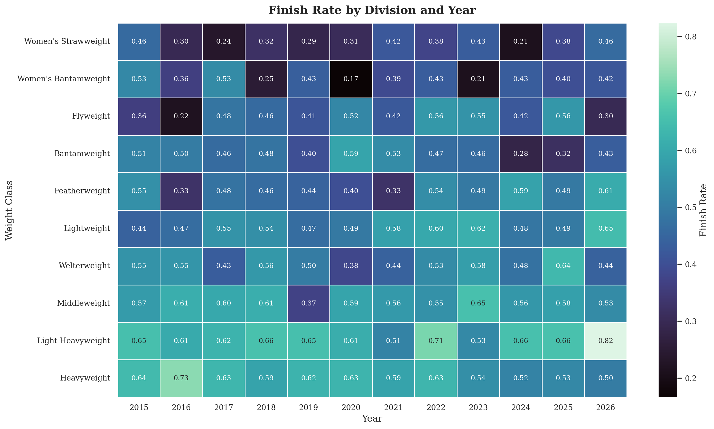
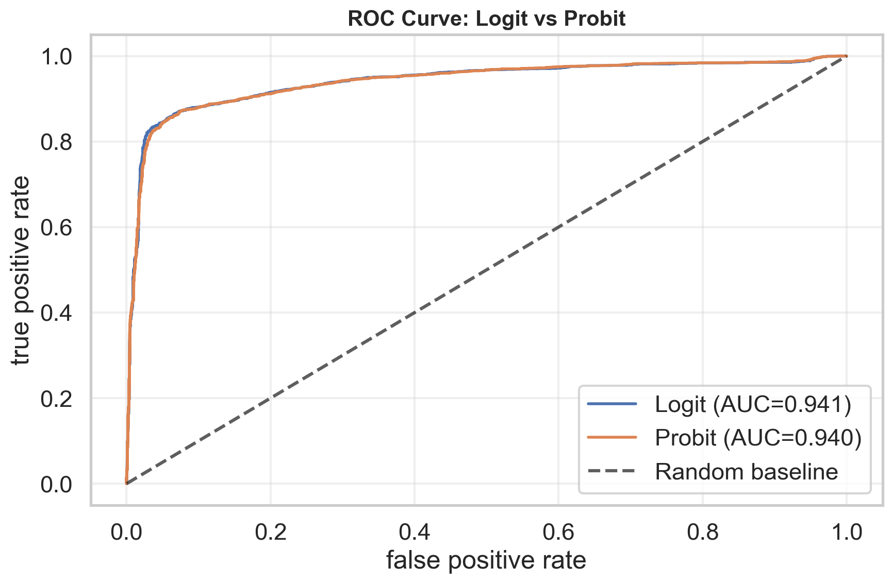

# UFC Analytics

## Overview
This project analyzes how UFC fight finishes evolve over time and across weight classes, then compares two probabilistic models (logit vs probit) for predicting whether a bout ends in a finish (KO/TKO or submission).

Why it matters:
- finish probability influences matchmaking strategy, fan engagement, and betting/risk models.
- division-level finish dynamics are not uniform, so aggregate trends can hide actionable differences.

## Data
### Source
- data is collected from public UFCStats event and fight tables via `src/scraping.py`.
- scraper target: `http://ufcstats.com/statistics/events/completed?page=all`.

### Schema
Raw records are written to `data/raw/ufc_event_data.csv` (or parquet) with this schema:

`Event, Date, Location, WL, Fighter_A, Fighter_B, Fighter_A_KD, Fighter_B_KD, Fighter_A_STR, Fighter_B_STR, Fighter_A_TD, Fighter_B_TD, Fighter_A_SUB, Fighter_B_SUB, Victory_Result, Victory_Method, Round, Time, Weight_Class, Title, Fight_Bonus, Perf_Bonus, Sub_Bonus, KO_Bonus`

### Ethical note
- this project uses publicly available event-level sports data.
- scraping is rate-limited and retry-aware to reduce server load.
- no personal secrets, private credentials, or non-public data are used.

## Methodology
- eda: yearly finish rates, division heatmaps, and outcome-mix heatmaps.
- feature engineering: bout-level totals (knockdowns, significant strikes, takedowns, submission attempts), strike differential, centered year, and weight-class indicators.
- inference/modeling: logit and probit binary classifiers on the same feature matrix.
- evaluation: calibration curves, ROC/AUC, and confusion-matrix metrics at threshold 0.5.

## Key Results
- finish rates remain near ~50% overall but show meaningful year-to-year swings.
- heavier men’s divisions are persistently more finish-prone than lighter and many women’s divisions.
- logit and probit perform almost identically (`AUC ≈ 0.94`), so threshold tuning is more impactful than model-family choice.







## Reproducibility
### 1) setup
```bash
python -m venv .venv
source .venv/bin/activate
pip install --upgrade pip
pip install -r requirements.txt
```

### 2) scrape fresh data
```bash
python -m src.scraping
```

Optional flags:
```bash
python -m src.scraping --start-year 2015 --end-year 2026 --output-format csv --delay-seconds 0.4
```

### 3) run analysis notebook
```bash
jupyter notebook notebooks/analysis.ipynb
```

### optional: use make targets
```bash
make setup
make scrape
make analyze
```

## Project Structure
```text
ufc-analytics/
  data/
    raw/
      .gitkeep
      .gitignore
    processed/
      .gitkeep
      ufc_event_data.csv
  figs/
    division_finish_heatmap.png
    finish_rate_trend.png
    roc_logit_probit.png
  notebooks/
    analysis.ipynb
  src/
    __init__.py
    analysis_utils.py
    scraping.py
  .gitignore
  Makefile
  README.md
  requirements.txt
```

## Limitations + Future Improvements
- current analysis is retrospective and not a causal model.
- model validation is in-sample; next step is time-based train/test validation.
- fighter-level context (age, camp changes, layoffs, rank trajectories) is not yet integrated.
- implementaion of forward looking prediction using fighter profiles.
