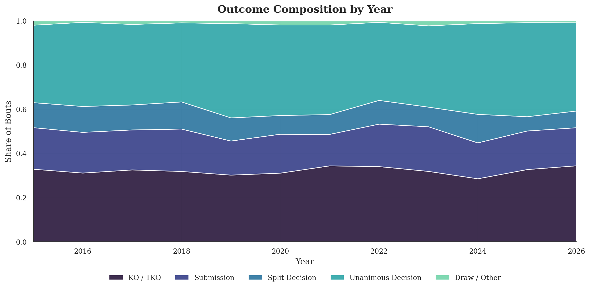
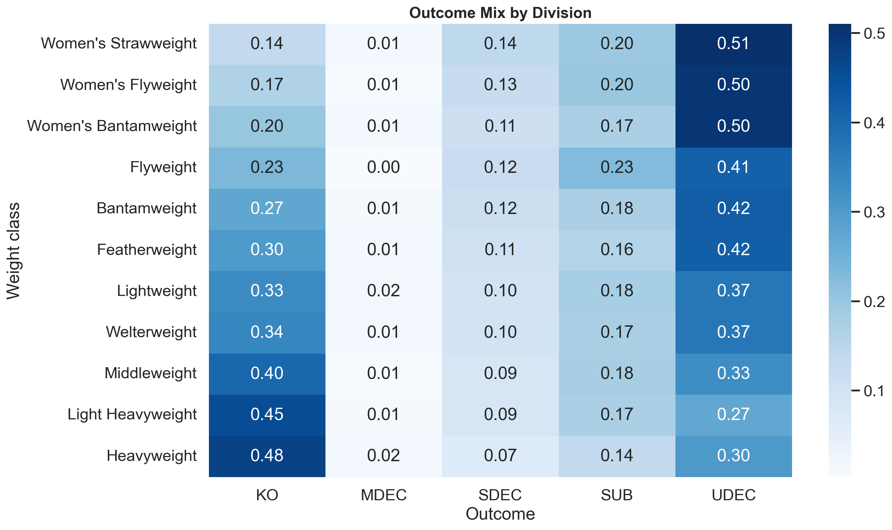

# UFC Analytics

## Overview
This project is an observational study of how UFC fights end in the modern era (2015 to 2026). Rather than building a predictive model, it follows the data to surface trends and patterns in finishes (KO/TKO or submission) versus decisions, both over time and across weight classes.

Why it matters:
- finish dynamics influence matchmaking strategy, fan engagement, and betting/risk models.
- division-level finish dynamics are not uniform, so aggregate trends can hide actionable differences.

## Data
### Source
- data is collected from public UFCStats event and fight tables via `src/scraping.py`.
- scraper target: `http://ufcstats.com/statistics/events/completed?page=all`.

### Schema
Raw records are written to `data/raw/ufc_event_data.csv` (or parquet) with this schema:

`Event, Date, Location, WL, Fighter_A, Fighter_B, Fighter_A_KD, Fighter_B_KD, Fighter_A_STR, Fighter_B_STR, Fighter_A_TD, Fighter_B_TD, Fighter_A_SUB, Fighter_B_SUB, Victory_Result, Victory_Method, Round, Time, Weight_Class, Title, Fight_Bonus, Perf_Bonus, Sub_Bonus, KO_Bonus`

The analysis step adds derived `Year` and `Outcome` (KO, SUB, SDEC, UDEC, DRAW) columns and writes a processed snapshot to `data/processed/ufc_event_data.csv`.

### Ethical note
- this project uses publicly available event-level sports data.
- scraping is rate-limited and retry-aware to reduce server load.
- no personal secrets, private credentials, or non-public data are used.

## Methodology
This is an exploratory, observational analysis. The notebook works through four questions:
1. is the overall finish rate drifting over time, or is it mostly stable?
2. how has the composition of outcomes (KO, submission, decision) shifted year to year?
3. which divisions are structurally finish-heavy, and which lean on the judges?
4. do divisions differ not just in how often fights finish, but in how they finish?

Each question is paired with a figure and a short written read of what the data shows, with open threads flagged for further work.

## Key Results
- the overall finish rate stays inside a tight band around 0.50 (standard deviation 0.026). Year-to-year movement is volatility rather than a durable trend.
- the composition of outcomes is remarkably persistent. Unanimous decisions and knockouts anchor the mix in every year, with the bands shifting modestly but never reordering.
- division is the dominant axis of variation. The average finish-rate spread from the most to least finish-prone class is roughly 29 percentage points, from Light Heavyweight at the top to Women's Strawweight at the bottom.
- divisions differ in finish mechanism, not just frequency. Heavyweight is knockout-forward, while Women's Strawweight is carried to the scorecards far more often.

### Finish rate over time


### Outcome composition over time


### Finish rate by division and year


### Outcome mix by division


## Reproducibility
### 1) setup
```bash
python -m venv .venv
source .venv/bin/activate
pip install --upgrade pip
pip install -r requirements.txt
```

### 2) scrape fresh data
```bash
python -m src.scraping
```

Optional flags:
```bash
python -m src.scraping --start-year 2015 --end-year 2026 --output-format csv --delay-seconds 0.4
```

### 3) run analysis notebook
```bash
jupyter notebook notebooks/analysis.ipynb
```

### optional: use make targets
```bash
make setup
make scrape
make analyze
```

## Project Structure
```text
ufc-analytics/
  data/
    raw/
      .gitkeep
      .gitignore
    processed/
      .gitkeep
      ufc_event_data.csv
  figs/
    division_finish_heatmap.png
    division_outcome_mix.png
    finish_rate_trend.png
    outcome_composition_trend.png
  notebooks/
    analysis.ipynb
  src/
    __init__.py
    analysis_utils.py
    scraping.py
  .gitignore
  Makefile
  README.md
  requirements.txt
```

## Limitations + Future Improvements
- the analysis is retrospective and observational, not a causal or predictive model.
- finish dynamics are tracked in aggregate; a natural next step is to follow individual divisions over time.
- round-by-round timing is not yet used, so the analysis captures how fights end but not when within a fight.
- title and main-event bouts are not separated from the undercard baseline.
- fighter-level context (age, camp changes, layoffs, rank trajectories) is not yet integrated.
